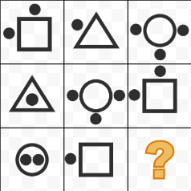
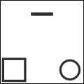

```json
{
  "type": "mcq",
  "difficulty": "hard",
  "topic": "Abstract Reasoning"
}
```

# Question Choice 1
```json
{
  "id": null,
  "correctOption": 3
}
```
## Common Text


### Hindi
Question mark ki jagah par sahi figure choose kijiye.

### English
PENDING

## Options
| Option | Values                                      |Id     |
|:-------|:--------------------------------------------|:-----:|
| 1      |  |null   |
| 2      |  |null   |
| 3      |  |null   |
| 4      |  |null   |


# Question Choice 2
```json
{
  "id": null,
  "correctOption": 2
}
```

## Common Text


### Hindi
Question mark ki jagah par sahi figure choose kijiye.

### English
PENDING

## Options
| Option | Values                                      |Id     |
|:-------|:--------------------------------------------|:-----:|
| 1      |  |null   |
| 2      |  |null   |
| 3      |  |null   |
| 4      |  |null   |
