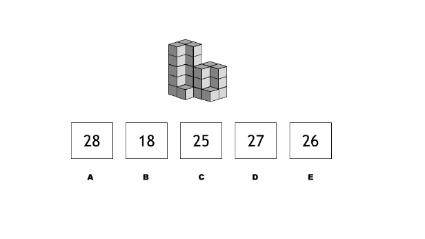
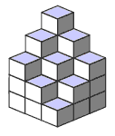

```json
{
  "type": "mcq",
  "difficulty": "easy",
  "topic": "Basic Math"
}
```

# Question Choice 1
```json
{
  "id": null,
  "correctOption": 3
}
```
## Common Text


### Hindi
Niche diye hue image kitne blocks se bana hua hai?

### English
PENDING

## Options
| Option | Values |Id     |
|:-------|:-------|:-----:|
| 1      | B      |null   |
| 2      | A      |null   |
| 3      | E      |null   |
| 4      | C      |null   |
| 5      | D      |null   |


# Question Choice 2
```json
{
  "id": null,
  "correctOption": 2
}
```
## Common Text


### Hindi
Neeche kuch chhote shapes diye huye hai. Un sab ko jod kar konsa bada shape banaya jaa sakta hai? Apna option choose kijiye aur answer wale page par likhiye.

### English
PENDING

## Options
| Option | Values |Id     |
|:-------|:-------|:-----:|
| 1      | 28     |null   |
| 2      | 29     |null   |
| 3      | 27     |null   |
| 4      | 25     |null   |
