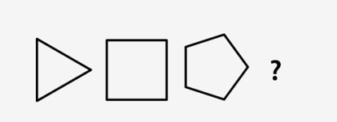
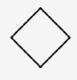
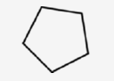
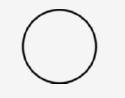
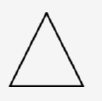
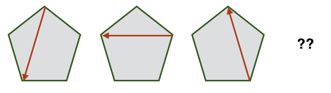
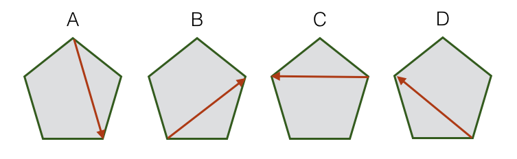

```json
{
  "type": "mcq",
  "difficulty": "hard",
  "topic": "Non Verbal Reasoning"
}
```

# Question Choice 1
```json
{
  "id": null,
  "correctOption": 3
}
```

## Common Text


### Hindi
नीचे दिए गए चित्रों में अगला चित्र चुनिए.

### English
What will be the next image in the series of images given below?

## Options
| Option | Values                                      |Id     |
|:-------|:--------------------------------------------|:-----:|
| 1      |  |null   |
| 2      |  |null   |
| 3      |  |null   |
| 4      |  |null   |


# Question Choice 2
```json
{
  "id": null,
  "correctOption": 3
}
```

## Common Text



### Hindi
नीचे दिए गए चित्रों में अगला चित्र चुनिए.

### English
What will be the next image in the series of images given below?

## Common Options
| Option | Values |Id     |
|:-------|:-------|:-----:|
| 1      | C      |null   |
| 2      | A      |null   |
| 3      | B      |null   |
| 4      | D      |null   |
