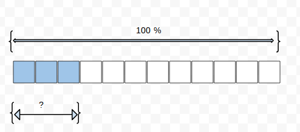
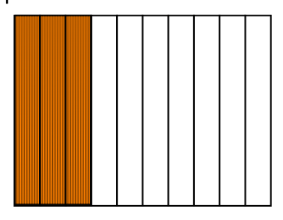

```json
{
  "type": "mcq",
  "difficulty": "medium",
  "topic": "Basic Math"
}
```

# Question Choice 1
```json
{
  "id": null,
  "correctOption": 3
}
```
## Common Text


### Hindi
चित्र का कितना प्रतिशत हिस्सा भरा हुआ है?

### English
What is the percentage of the shaded area?

## Options
| Option | Values                 |Id     |
|:-------|:-----------------------|:-----:|
| 1      | 25%                    |null   |
| 2      | 35%                    |null   |
| 3      | 30%                    |null   |
| 4      | 40%                    |null   |


# Question Choice 2
```json
{
  "id": null,
  "correctOption": 2
}
```

## Common Text


### Hindi
चित्र का कितना प्रतिशत हिस्सा भरा हुआ है?

### English
What is the percentage of the shaded area?

## Options
| Option | Values                 |Id     |
|:-------|:-----------------------|:-----:|
| 1      | 25%                    |null   |
| 2      | 35%                    |null   |
| 3      | 30%                    |null   |
| 4      | 40%                    |null   |
