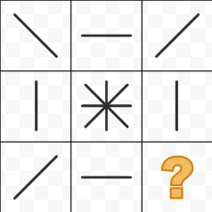
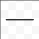

```json
{
  "type": "mcq",
  "difficulty_level": "easy",
  "category": "BASIC_MATH"
}
```

# Question Choice 1
```json
{
  "Question ID": "21",
  "Correct Answer": 3
}
```
## Common Text


## Hindi
Question mark ki jagah par sahi figure choose kijiye.

## English
PENDING

### Options
| Option | English Values                              | Hindi Values                                |Id     |
|:-------|:--------------------------------------------|:--------------------------------------------|:-----:|
| 1      |  |  |59     |
| 2      |  |  |60     |
| 3      |  |  |61     |
| 4      |  |  |62     |


# Question Choice 2
```json
{
  "Question ID": "22",
  "Correct Answer": 2
}
```
## Common Text


## Hindi
Question mark ki jagah par sahi figure choose kijiye.

## English
PENDING

### Options
| Option | English Values                              | Hindi Values                                |Id     |
|:-------|:--------------------------------------------|:--------------------------------------------|:-----:|
| 1      |  |  |63     |
| 2      |  |  |64     |
| 3      |  |  |65     |
| 4      |  |  |66     |
