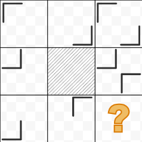
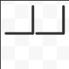
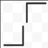
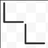
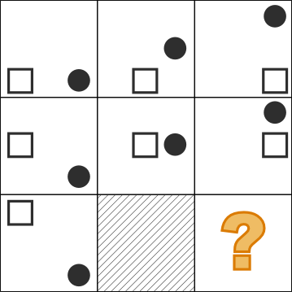
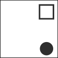
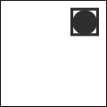

```questionMetaData
{
  "type": "mcq",
  "difficulty_level": "easy",
  "category": "BASIC_MATH"
}
```

# Question Choice 1
```questionChoiceMetaData
Question ID: NOT_ADDED
Correct Answer: 3
```

## Hindi
Question mark ki jagah par sahi figure choose kijiye.



### Options
| Option | Values                                      |
|:-------|:-------------------------------------------:|
| 1      |  |
| 2      |  |
| 3      |  |
| 4      |  |

## English
PENDING

# Question Choice 2
```questionChoiceMetaData
Question ID: NOT_ADDED
Correct Answer: 2
```

## Hindi
Question mark ki jagah par sahi figure choose kijiye.



### Options
| Option | Values                                      |
|:-------|:-------------------------------------------:|
| 1      |  |
| 2      |  |
| 3      |  |
| 4      |  |


## English
PENDING
