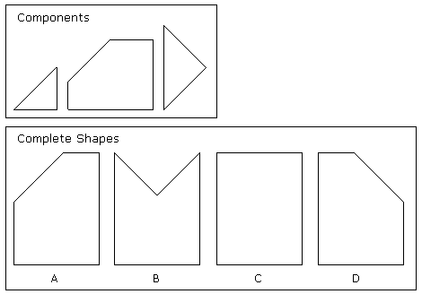

```json
{
  "type": "mcq",
  "difficulty_level": "easy",
  "category": "BASIC_MATH"
}
```

# Question Choice 1
```json
{
  "Question ID": "41",
  "Correct Answer": 3
}
```
## Common Text


## Hindi
Niche diye hue image ka reflection kaisa hoga?

## English
PENDING

## Common Options
| Option | Values |Id     |
|:-------|:-------|:-----:|
| 1      | E      |130    |
| 2      | A      |131    |
| 3      | C      |132    |
| 4      | B      |133    |
| 5      | D      |134    |


# Question Choice 2
```json
{
  "Question ID": "42",
  "Correct Answer": 2
}
```

## Common Text


## Hindi
Neeche kuch chhote shapes diye huye hai. Un sab ko jod kar konsa bada shape banaya jaa sakta hai? Apna option choose kijiye aur answer wale page par likhiye.

## English
PENDING

## Common Options
| Option | Values |Id     |
|:-------|:-------|:-----:|
| 1      | D      |135    |
| 2      | C      |136    |
| 3      | B      |137    |
| 4      | A      |138    |
