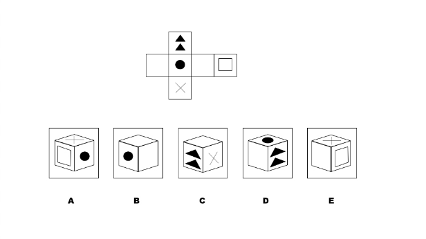
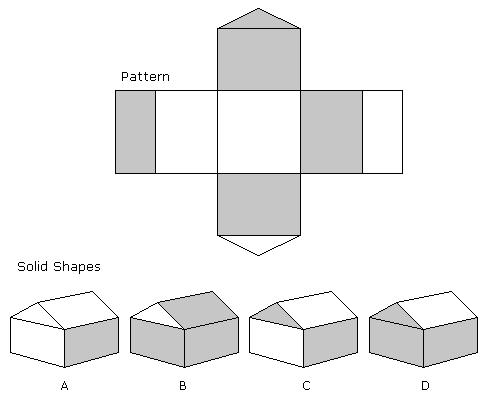

```json
{
  "type": "mcq",
  "difficulty_level": "easy",
  "category": "BASIC_MATH"
}
```

# Question Choice 1
```json
{
  "Question ID": "35",
  "Correct Answer": 3
}
```
## Common Text


## Hindi
Fold karne ke baad, ye 2D image kis box ki tarah banega?

## English
PENDING

## Common Options
| Option | Values |Id     |
|:-------|:-------|:-----:|
| 1      | A      |103    |
| 2      | E      |104    |
| 3      | B      |105    |
| 4      | C      |106    |
| 5      | D      |107    |


# Question Choice 2
```json
{
  "Question ID": "36",
  "Correct Answer": 2
}
```
## Common Text


## Hindi
Fold karne ke baad, ye 2D image kis house ki tarah banega?

## English
PENDING

## Common Options
| Option | Values |Id     |
|:-------|:-------|:-----:|
| 1      | A      |108    |
| 2      | D      |109    |
| 3      | B      |110    |
| 4      | C      |111    |
