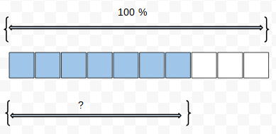
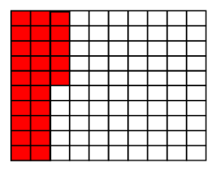

```json
{
  "type": "mcq",
  "difficulty_level": "easy",
  "category": "BASIC_MATH"
}
```

# Question Choice 1
```json
{
  "Question ID": "NOT_ADDED",
  "Correct Answer": 2
}
```
## Common Text


## Hindi
Shaded area poore area ka kitna percent hai?

## English
PENDING

## Common Options
| Option | Values                 |Id     |
|:-------|:-----------------------|:-----:|
| 1      | 50%                    |NULL   |
| 2      | 70%                    |NULL   |
| 3      | 60%                    |NULL   |
| 4      | 80%                    |NULL   |


# Question Choice 2
```json
{
  "Question ID": "NOT_ADDED",
  "Correct Answer": 3
}
```

## Common Text


## Hindi
Neeche di gayi picture mein dekh ke batao ki pure mein se kitna area shaded hai?

## English
PENDING

## Common Options
| Option | Values                 |Id     |
|:-------|:-----------------------|:-----:|
| 1      | 2/5                    |NULL   |
| 2      | 1/3                    |NULL   |
| 3      | 1/4                    |NULL   |
| 4      | 1/5                    |NULL   |
